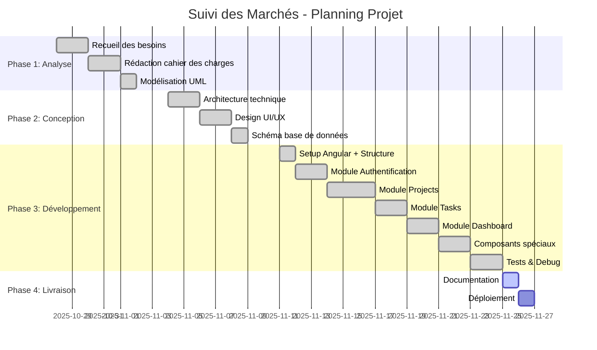

# Diagramme de Gantt - Suivi des Marchés

## Version Mermaid (Recommandée)

## Légende

| Statut | Couleur | Description |
|--------|---------|-------------|
| `done` | 🟢 Vert | Tâche terminée |
| `active` | 🔵 Bleu | Tâche en cours |
| (vide) | ⬜ Gris | Tâche à faire |

## Comment utiliser

1. **GitHub/GitLab** : Copiez ce fichier dans votre repo, le Gantt s'affiche automatiquement
2. **VS Code** : Installez l'extension "Markdown Preview Mermaid Support"
3. **En ligne** : Collez sur https://mermaid.live pour exporter en PNG/SVG

